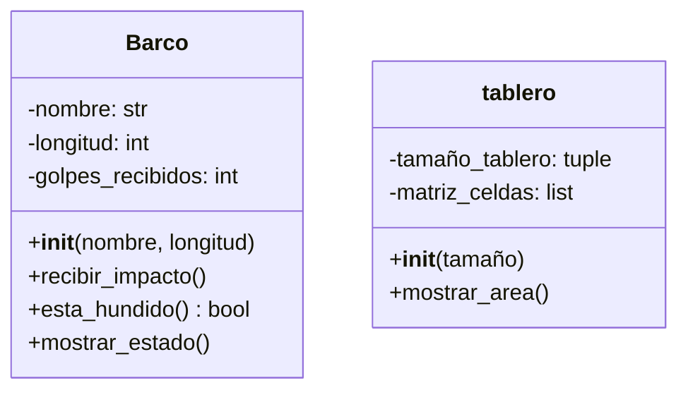

# Tarea: Actualizacion (simulado)

## Objetivo
Diferenciar y aplicar git fetch, merge y pull --rebase.

## Comandos usados
- git fetch origin
- git merge origin/main
- git pull --rebase

## Pregunta de control: ¿Cuándo se elige una estrategia u otra?

Se elige merge cuando quiero mantener visible todo el historial de cómo se han unido los cambios, especialmente si hay varios colaboradores y quiero que se note qué commits se combinaron.

Por otro lado, uso rebase cuando quiero que el historial quede lineal y limpio, aplicando mis cambios locales encima de los remotos, sin que aparezcan merge commits que lo ensucien.

